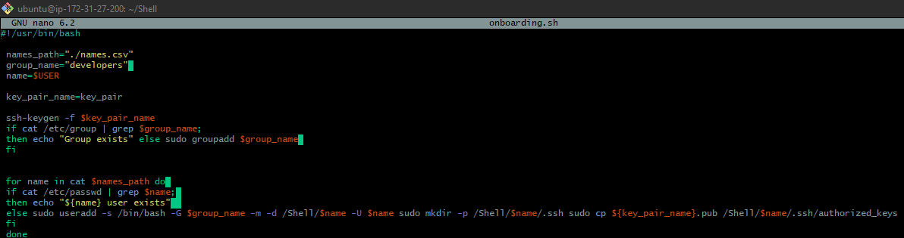

# #  AUX PROJECT 1: SHELL SCRIPTING

1. Creat the project folder called shell


mkdir shell


2. Create a csv file name names.csv

touch names.csv  

vim names.csv and add 20 names

3. create group developers
 
sudo groupadd developers

4. Creating script
touch onboarding.sh

Giving execute permission to the onboarding.sh  file
```
 Sudo Chmod +X onboarding.sh
```


# Vi onboarding.sh and insert the script below


Running the script
1. 


